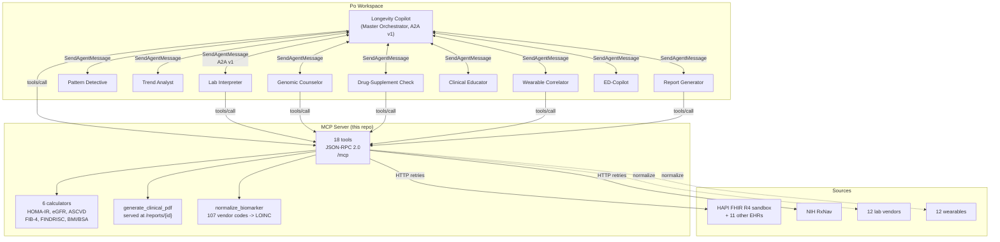

# Longevity Copilot MCP Server (v1.7)

## Architecture (the clean split)

**This server is the data plane.** It reads from labs / wearables / EHRs and normalizes everything to FHIR R4 + LOINC + UCUM. That is its job.

The action layer lives in Po agents:
- **Report Generator** owns clinical PDFs and FHIR write-back.
- **Trend Analyst** owns chart rendering.
- **Drug-Supplement Check** owns drug-drug / drug-supplement reasoning.
- **Clinical Educator** owns patient-facing PDFs.
- **ED-Copilot** owns vitals interpretation.

The server exposes 32 MCP tools split into three layers (visible via `discover` or `list_supported_sources`):

- **data-plane** (14): patient reads, normalization, conversion, reference ranges, simulator
- **agent-helper** (15): PDF/chart/FHIR-write/calculator services, each scoped to exactly one Po agent via the Tools tab
- **ops** (3): audit, list_reports, discover

The orchestrator never calls agent-helper tools directly. It routes to the specialist who owns them. See `../PO_REGISTRATION.md` for the per-agent Tools-tab assignments.

The data plane for Longevity Copilot. A Streamable-HTTP MCP server that exposes patient data, clinical calculators, and patient-ready PDF generation to the Prompt Opinion orchestrator and its nine A2A specialists. It normalizes vendor outputs across 12 lab vendors (Quest, LabCorp, Boston Heart, Genova, Diagnostic Solutions, Doctor's Data, Vibrant, ZRT, Cleveland HeartLab, Spectracell, Dutch, Cyrex), 12 wearables (Oura, Whoop, Apple Health, Withings, Garmin, Fitbit, Polar, Dexcom CGM, FreeStyle Libre, Levels, Eight Sleep, Veri), and 12 EHR / FHIR sources (HAPI FHIR, SMART Health IT, Epic R4, Cerner/Oracle Health, AthenaHealth, MEDITECH, Allscripts, NextGen, eClinicalWorks, Practice Fusion, Drchrono, Kareo) to canonical FHIR R4 + LOINC + UCUM.

Built on FastAPI. Single file. Bearer-token auth, structured audit logging, httpx retries with exponential backoff, CORS, dependency health check, A2A v1 agent card, PDF generation served at `/reports/{id}`. Live-tested against the HAPI FHIR public sandbox. Ships with a synthetic Tyrone Schiller patient for offline demos.

```
Test status
  Unit tests (pytest, offline)        23/23 PASS
  HTTP + RPC harness                  26/26 PASS
  HTTP + RPC harness with bearer auth 27/27 PASS
  Clinical calculator literature      15/15 PASS
```

## Architecture



## What it exposes

Twelve MCP tools, all reachable via JSON-RPC 2.0 at `POST /mcp`:

**Patient data**
| Tool | What it does |
|---|---|
| `get_patient_demographics` | First name, last initial, DOB, sex. PHI-minimized. |
| `get_patient_labs` | Resulted Observations, LOINC + UCUM normalized. 60+ vendor codes covered. |
| `get_patient_medications` | MedicationStatement, RxNorm-coded. |
| `get_patient_genomics` | SNP / genotype variants (synthetic by default). |
| `get_wearable_snapshot` | HRV, RHR, sleep stages (synthetic by default). |
| `normalize_biomarker` | Vendor code -> canonical LOINC + UCUM. |
| `fhir_passthrough` | Arbitrary FHIR R4 read against the configured base. |

**Clinical calculators (deterministic - agent never invents the math)**
| Tool | What it does |
|---|---|
| `calc_homa_ir` | HOMA-IR insulin resistance (Matthews 1985). |
| `calc_egfr_ckdepi_2021` | eGFR CKD-EPI 2021 race-free creatinine equation (NEJM). |
| `calc_ascvd_10yr` | ACC/AHA 2013 Pooled Cohort 10-year ASCVD risk. |

**Terminology + observability**
| Tool | What it does |
|---|---|
| `rxnav_interactions` | NIH RxNav drug name -> RxCUI + properties. |
| `audit_tail` | Last N audit events, for debugging routing failures. |

When the caller omits `patient_id` (or passes `tyrone`), the server returns the synthetic Tyrone Schiller fixture. When `patient_id` is set, it proxies live to the FHIR base in `HAPI_FHIR_BASE` (default: `https://hapi.fhir.org/baseR4`).

## Run it locally

```bash
pip install -r requirements.txt
uvicorn server:app --host 0.0.0.0 --port 8080
```

Smoke test (unauthenticated):

```bash
bash test_harness.sh http://127.0.0.1:8080
```

Expected: `RESULTS: 21 passed, 0 failed`.

Smoke test with bearer auth:

```bash
MCP_BEARER_TOKEN=your-secret uvicorn server:app --host 0.0.0.0 --port 8080
bash test_harness.sh http://127.0.0.1:8080 your-secret
```

Expected: `RESULTS: 22 passed, 0 failed`.

## Deploy somewhere stable

Pick whichever doesn't sleep on you. The Cloudflare-tunnel approach used previously dies when the laptop closes - don't repeat that.

**Render** (free tier, sleeps after 15 min, fine for demos):
1. New Web Service -> connect this folder.
2. Build Command: `pip install -r requirements.txt`
3. Start Command: `uvicorn server:app --host 0.0.0.0 --port $PORT`
4. The URL you get is what you paste into Po.

**Fly.io** (free allowance, doesn't sleep):
```bash
fly launch --no-deploy
fly deploy
```
Fly auto-detects the Dockerfile.

**Railway** (the previous deploy is dead, redeploy fresh):
1. New Project -> Deploy from GitHub repo.
2. Railway detects Dockerfile automatically.
3. Set `PORT` env var if needed.

**Cloudflare Workers** (zero cold start, free) - requires porting to JS. Out of scope for this repo.

## Register in Prompt Opinion

After deploy, get your HTTPS URL (eg `https://your-app.onrender.com`):

1. Po workspace -> Configuration -> MCP Servers -> Add MCP Server
2. Friendly Name: `Longevity Copilot MCP`
3. Endpoint: `https://your-app.onrender.com/mcp`
4. Transport Type: `Streamable HTTP`
5. Authentication: `No Authentication (Open)` for the demo. Add bearer-token auth for prod.
6. Click Continue. Po will call `tools/list` and populate the MCP Tools tab.
7. Open Longevity Copilot orchestrator -> Tools tab -> tick the MCP tools you want exposed.

## Test the live deployment

```bash
bash test_harness.sh https://your-app.onrender.com
```

Same 10 checks. The harness picks a fresh patient ID off the HAPI FHIR sandbox each run, so test 7 proves the live-FHIR proxy is working end-to-end.

## Environment variables

| Var | Default | Purpose |
|---|---|---|
| `PORT` | `8080` | HTTP listen port |
| `HAPI_FHIR_BASE` | `https://hapi.fhir.org/baseR4` | FHIR R4 base URL. Swap for SMART Health IT, your tenant's Epic R4, or an internal FHIR proxy. |
| `MCP_BEARER_TOKEN` | unset | If set, all `/mcp` calls require `Authorization: Bearer <value>`. Leave unset for open dev mode. |

## Hackathon alignment

The Devpost "Agents Assemble" rubric (Stage 1, pass/fail) requires the submission to be built as an MCP Server or A2A Agent, verified in the Po marketplace, and Po-discoverable. This is the MCP Server half. The A2A half is the Longevity Copilot orchestrator + nine linked specialists registered in the same workspace.

The MCP boundary is also what makes the demo's "synthetic data only" claim true: when `patient_id` is `tyrone` (or omitted), the server returns deterministic synthetic data and never touches a real FHIR server.
